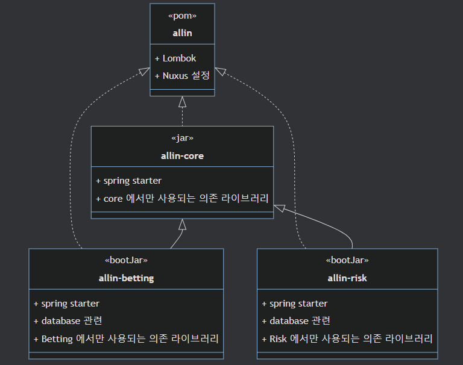

# All-IN system
- allin system 프레임워크를 개발하면서 공부한 내용을 정리

## 1. 개요 
- http 방식이 아닌 message queue 방식으로 비동기 네트워크 통신이 발생한다.
- Spring DI Container 기반 위에 개발을 진행하였다.
- SI Business 개발자들이 관점을 분리해서 business model 개발만 집중할 수 있는 환경을 제공 
- 실시간 대량 트래픽 처리가 필요한 프레임워크로 성능 검증을 위한 테스트 환경 구축 필요

## 2. 아키텍처

- (1) receiver 는 message queue 를 listener 를 하고 있다가, message 가 들어오면 dispatcher에게 전달한다.
- (2) dispatcher 는 receiver 에게 요청을 받으며, 미리정의된 방식(pool, bq)으로 다른 스레드를 할당한다.
- (3) dispatcher 에서 message 정보를 분석하고, 이를 처리할 수 있는 business model 찾아 메시지를 전달하는 역할을 한다.
- (4) business model 에서 타 시스템에게 message 전달하기 위해서는 sender 에게 위임하여 이를 처리한다.

### 2.0 전문 형태 정의 
- Http 방식으로 전달하지 않기에 먼저 전문 형태를 정의해야 된다.
- 길이가 고정된 fixed-length 방식을 사용하면 시스템 종속적이고, Http 방식도 사용할 수 없기에 새로운 allin-protocol 을 정의하였다.
```text
url=/normal-api // (1)
transactionId=778a8f3e-7ae9-4cdc-9d74-832e07b18f8c // (2)
contentType=JSON // (3)
contentLength=39 // (4)
// (5)
{"username":"kimtaehan\nTest","age":30} // (6)
```
- (1) ~ (4) 까지 header 데이터로 확장성을 위해 필요에 따라 추가할 수 있는 구조이다.
- header 는 `=` 구분자로 key, value 를 구분하지만 header 데이터가 사용될지는 클라이언트~서버 간에 알아서 선택하는 방식이다.
- (5) header, body 를 구분하기 위한 \n 를 하나 입력한다.
- (6) 나머지는 전부 body 데이터이며, contentType 에 따라 알아서 입력하자 (여기서는 json 형태로 body를 사용한다)


### 2.1 receiver 
- message queue 를 기다리고 있는 listener thread group 과 이를 받아서 처리하는 worker thread group 으로 구분할 수 있다. 
- listener thread group 과 worker thread group 은 미리 정의된 blocking queue 방식으로 통신하고 있다. 
- receiver 는 여러가지 채널에서 응답을 받을 수 있게 구성되어 있으며 (hazelcast, activeMq, Netty) 더 많은 채널을 확장할 수 있는 구조로 만들었다.
- 참고모델: Netty 이벤트 루프, Tomcat Servlet
- [자세히 보기](document%2Fmd%2F2100_receiver.md)


### 2.2 dispatcher
- receiver 에서 받은 요청을 business model 과 연동하기 위한 FrontController 역할을 수행한다.
- Spring DispatcherServlet 처럼 annotation 기반으로 동작되며, HandlerManager, ArgumentResolver 등의 라이브러리도 구현하여 유연하게 business model 을 호출하도록 설계하였다. 
- business model 에 thread 가 할당되는 방식은 2가지이며, threadPool 방식과 blockingQueue 방식을 지원한다. 
- 참고모델: Spring DispatcherServlet, Tomcat Servlet
- [dispatcher 자세히 보기](document%2Fmd%2F2200_dispatcher.md)
- [HandlerManager 자세히 보기](document%2Fmd%2F2280_handler.md)
- [ArgumentResolver  자세히 보기](document%2Fmd%2F2290_argument_resolver.md)


### 2.3 blocking queue
- BlockingQueue 는 java 에서 제공하는 thread 사이에 안전한 Queue 알고리즘을 제공하는 인터페이스이다. 
- allin 시스템에서는 BlockingQueue 를 많이 사용하기에 이를 wrapping 하여 손쉽게 사용할 수 있는 기능을 제공하고 있다. 
- BlockingQueue 생성과 이를 처리하는 thread 등을 공통적으로 생성하고 관리하는 기능을 Spring di container 를 통해 수행하고 있다. 
- 또한 (2.2) dispatcher 와 연계하여 business model을 호출할 수 있는 기능도 제공하고 있다.  
- [자세히 보기](document%2Fmd%2F2300_blockingqueue.md)


### 2.4 exception advice
- business model 을 처리하다가 예외를 핸들링 하기위해 try/catch 문을 사용하여 exception 을 처리할 수 있지만 이는 비효율적인 코드를 유발하게 된다. 
- XExceptionAdvice 는 allin system business model 에서 exception 발생시 이를 Client 에 나가기 전에 잡아서 처리할 수 있는 프로세스이다.
- Spring Web application 에서는 ControllerAdvice 라는 이름으로 비슷한 기능을 제공하고 있다. 
- 참고모델: Spring ControllerAdvice, ExceptionHandler
- [자세히 보기](document%2Fmd%2F2400_exception_advice.md)
 


### 2.5 Cache
- allin 시스템 business model 특징중 하나로 Cache 데이터를 많이 사용하고 있다. 
- 단일 서버, 멀티 서버 Cache 을 business model 에서 별도 작업없이 spring di container 등록 만으로 사용할 수 있게 지원한다.
- 기능은 구현해놓고 실제 구현방법은 변경할 수 있는 구조로 만들어져있다. 
- 현재 SingleServerCache 는 ConcurrentHashMap 으로 구현되어 있지만 필요시 이를 EL Cache 로 변경해도 business model 은 수정이 필요하지 않다.
- [자세히 보기](document%2Fmd%2F2500_cache.md)


### 2.6 message finder
- 미리 정의된 message 를 읽고 싶은 경우 사용하는 message finder 를 추상화를 통해 실제 구현체에 따라 변경할 수 있도록 만들었다. 
- Allin System 에서는 message 를 읽는 방법이 2가지 존재할 수 있다. (properties or database)
- [자세히 보기](document%2Fmd%2F2600_message_finder.md)

### 2.7 sender
- XRequest 기반으로 패킹하여 원하는 XTarget 으로 메시지를 보낼 수 있는 기능을 제공한다.
- business model 에서는 원하는 XTarget 전용 BlockingQueue 에 XRequest 객체만 입력하게 되면, 이후에는 별도의 Sender Group thread 가 이를 받아서 외부채널에 요청을 보내는 방식이다.
- [자세히 보기](document%2Fmd%2F2700_sender.md)


### 2.8 executor
- web application 은 tomcat 에서 요청온 request 에 대해서 thread 를 할당시켜 요청이 처리될 수 있게 해주는 기능이 존재한다. 
- allin system 에서는 그 부분을 직접 control 해야 된다. (다음부터 그냥 http 사용하자)
- allin system 에서는 executor 는 3가지 모델에서 사용되고 있다. (Business, Receiver, BlockingQueue)
- 단순한 thread-pool 이 아닌 우아하게 종료될 수 있는 기능이 필요하다.
- [자세히 보기](document%2Fmd%2F2700_executor.md)


## 3. advance subject 
### 3.1 우아하게 종료하기 
- allin 시스템에서 Thread 를 별도로 관리하게 되면서 애플리케이션이 한번에 죽지않는 문제가 발생하기 시작하였다. 
- 자바는 thread 기반으로 수행되는 언어로 종료를 하기 위해서는 데몬 형태의 스레드를 제외한 모든 스레드가 종료되어야 정상적인 종료가 이루어진다.
- [자세히 보기](document%2Fmd%2F3100_gracefully_quit.md)


### 3.2 warmup 하고 시작하기
- allin 시스템은 아직 준비가 되지 않았는데, 외부 요청 트래픽은 미리 들어와서 기다리고 있는 현상이 발생하였다.
- 만약 여러대의 서버에서 동일한 어플리케이션을 처리한다면, 다른 서버에서 처리할 수 있는 요청에 대한 지연이 발생할 수 있게 된다. 
- [자세히 보기](document%2Fmd%2F3200_warmup.md)

### 3.3 멀티 모듈을 사용하기
- allin 시스템은 상호 연결된 여러개의 process 를 만들어야 하고, 이를 하나의 프로젝트에 관리하는 것이 훨씬 편한 방법이라 멀티모듈을 도입하였다.
- java 에서 module 은 package 한 단계 위에 집합체이며, 관련된 패키지와 리소스를 재사용할 수 있고, 독립적으로 개발, 빌드, 테스트, 배포가 가능하다.
- multi module project 는 상호 연결된 여러 개의 module 로 구성된 프로젝트를 의미한다. 
- [자세히 보기](document%2Fmd%2F3300_multi_module.md)



### 3.4 auto configuration
- Spring Boot의 자동 설정 기능은 의존성만 추가가해주면 Spring Boot가 뒤에서 필요한 설정들(Bean 설정 및 생성)을 자동으로 구성한다.
- core 에 있는 라이브러리를 자동으로 bean 으로 등록하고 이를 통해서 비지니스 모듈에서 사용할 수 있게 하는 기능
- [자세히 보기](document%2Fmd%2F3400_auto_configuration.md)

### 3.5 virtual thread
- virtual thread 는 자바 21 버전 부터 정식 도입된 기능 (java 21 이상 버전 사용)
- 기존의 자바의 thread (platform thread or user thread) 는 context switching 비용으로 인해 부가적인 리소스 소모가 큼
- 가상 스레드 란 기존의 전통적인 Java 스레드에 더하여 새롭게 추가되는 경량 스레드이며, 하나의 Java 프로세스가 수십만~ 수백만개의 스레드를 동시에 실행할 수 있게끔 설계
- 가상 스레드 를 사용하더라도 응답속도가 빨라지지는 않는다. (오히려 약간 느려질 수도). 다만 처리량이 늘어날 수 있다.
- [자세히 보기](document%2Fmd%2F3500_virtual_thread.md)

| |기존 스레드| 가상 스레드|
|--|--|--|
|메타 데이터 사이즈|약 2kb|200~300 B|
|메모리|미리 할당된 Stack 사용|필요시 마다 Heap 사용|
|컨텍스트 스위칭 비용|1~10us (커널영역에서 발생하는 작업)|ns (or 1us 미만)|

### 3.6 Logging framework
- SLF4J(Simple Logging Facade for Java)는 다양한 로깅 프레임 워크에 대한 추상화(인터페이스) 역할을 하는 라이브러리
- Spring 에서 표준으로 사용하고 있는 Logback 을 사용하려고 했으나, Log4j2 가 더 좋은 성능을 가지고 있다고 하여 이를 사용하기로 함.
- Spring 에서 처음 logging 표준을 정할 시점에는 Log4j2 가 나오기 전이었고, 그전 버전인 Log4j 보다는 Logback 의 성능이 좋아 LogBack 이 표준이 됨
- [자세히 보기](document%2Fmd%2F3600_logging.md)

### 3.7 BlockingQueue 성능
- Blocking Queue는 동시성 프로그래밍에서 사용되는 스레드 안전한 큐이다
- Lmax Disruptor 오픈 소스에 대해서 계속해서 요청이 있어서 이와 관련되 내용을 찾다가 정리한 내용이다.
- [자세히 보기](document%2Fmd%2F3700_blockingqueue_performance.md)

### 3.8 자바 데이터 전송 (serializable)
- 데이터 전송은 결국 byte[] 데이터를 주고 받는 기능인데, 고성능 전송데이터를 원해서 관련된 내용을 정리하였다. 
- 기본적인 java serializable, json 데이터 부터 구글에서 만든 proto buffer, sbe(simple binary encoding)까지 정리한다.
- [자세히 보기](document%2Fmd%2F3800_serializable.md)
