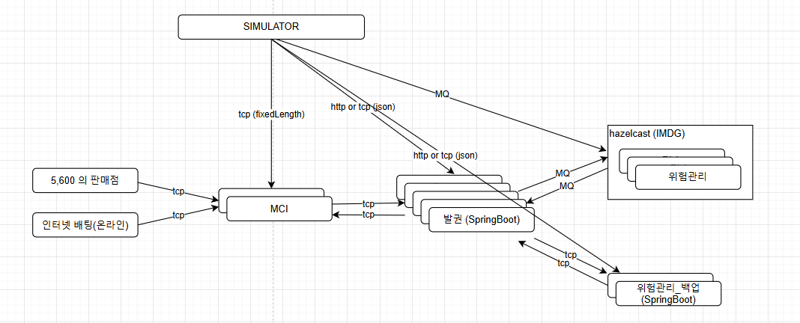

# 발매 시스템
- 5,600대의 판매점과 온라인으로 들어온 발매 요청을 처리하는 시스템
- 일 평균 100만 건 정도 판매되며, 트래픽은 2배 이상으로 예상됨

## System 전체 구성도

- (1) 판매점, 온라인(이하 client)과 MCI(server) 개념으로 TCP 통신이 발생하며, 솔루션에서 제공하는 기능
- (2), (4) MCI-발권, 발권-위험관리(백업) 간의 TCP 통신에서 양방향 서버 및 클라이언트 기능을 모두 제공해야 함
- (3) 발권과 위험관리 사이의 통신은 message broker 방식으로 수행되며, 프레임워크에서 공통 기능을 제공하고 있음

## 발매 시스템 이슈 
### 1. TCP 모듈 개발
- MCI-발권, 발권-위험관리(백업) 간의 TCP 서버 및 클라이언트 모듈 개발
- N 대 N 서버 간의 통신으로 분산 처리, health check, 트래픽 제어 등의 기능을 제공
- 선도 개발 시에는 MQ 방식으로 구현했으나, 이후 백업 모드 관련 이슈가 제기되며 설계가 변경됨
- 데이터 구조는 JSON byte array로 구성됨

### 2. 위험관리 동적 검증 
- 발매 요청 데이터에 대해 실시간으로 검증하는 프로세스
- 각 요청을 병렬이 아닌 1건씩 검증하며, 그 결과가 다른 요청에 영향을 끼치는 업무로 성능에 가장 큰 리스크가 존재함
- 예를 들어, 고속도로는 N차선이지만 하이패스가 1차선으로 제한됨 (AS-IS)

### 3. hazelcast 지원 
- (2)번 문제로 인해 Hazelcast(in-memory DB)가 도입되었으며, 차후 모델에서는 위험관리 전체가 Hazelcast 프레임워크 위에서 동작하는 방식으로 구성됨
- 현재 엑솔(주)에서 한국 협력업체로 지정되어 프로젝트를 지원하고 있었으나, 선도 개발에서 모든 리소스를 사용하여 추가 비용이 발생함
- Hazelcast 위에 올라가는 위험관리는 자바로 구현되지만, Hazelcast 자체 기능 및 자바의 동시성과 내부 구조를 직접 제어해야 하는 부분이 존재함
  - 예) 스레드 풀 관리 (ExecutorService), Hazelcast 기능 (IMap, IQueue, EntryProcessor)
- 선도 개발에서 프로토타입과 파일럿 두 가지 모드가 존재했으며,
  - 프로토타입은 엑솔에서, 파일럿은 발매 개발자가 진행함
  - 성능 차이: 1200 TPS vs 250 TPS (원인 파악을 하지 못함)

### 4. 발권 프레임 워크 개발 지원
- Spring DI Container 기반에서 HTTP 방식이 아닌 message queue 또는 TCP 방식으로 비동기 네트워크 통신이 발생
- 주요 기능: network IO, dispatcher controller, thread 제어, exception handler, blockingQueue
- 프레임워크가 주요 기능을 담당하여 SI 개발자가 자바 내부 기술에 대한 고민 없이 비즈니스 업무 개발에 집중할 수 있도록 구성
- [상세 내용](https://github.com/kim-taehan/allin)

## 시뮬레이터 
- 발매 시스템은 별도의 화면이 존재하지 않는 구조이므로, 개발자들이 단위 테스트할 수 있는 기능이 필요함
- MCI를 통해 통합 테스트, HTTP 및 MQ를 활용한 발권, 위험관리, 위험관리(백업)의 단위 테스트 기능을 제공하기 위해 구성됨
- RFP에서 시뮬레이터 구현 요구사항이 있으며, 기존 AS-IS(Java Swing)에서도 동일한 기능을 제공
- TO-BE에서는 Web 기반으로 구현 (Spring Boot, Thymeleaf, JPA, Hazelcast)
