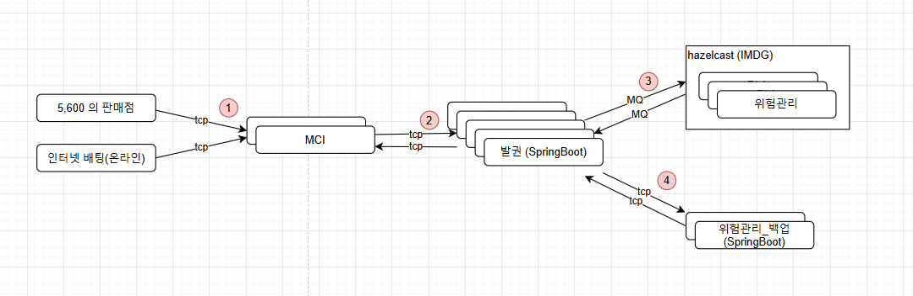

# 발매 시스템
- 5,600 대의 판매점과 온라인으로 들어온 발매 요청을 처리하는 시스템
- 일 평균 100만건 정도 판매되며, 트래픽은 2배 이상으로 예상됨

## System 전체 구성도

- (1) 판매점, 온라인과(이상 client) MCI (server) 개념으로 TCP 통신이 발생하며 솔루션에서 제공하는 기능 
- (2), (4) MCI-발권, 발권-위험관리(백업) 간의 TCP 통신으로 양방향으로 각각 서버, 클라이언트 기능을 모두 제공해야 함
- (3) 발권과 위험관리 사이에 통신은 message broker 방식으로 수행되며, 프레임워크에서 공통 기능을 제공하고 있음

## 발매 시스템 이슈 
### 1. TCP 모듈 개발
- MCI-발권, 발권-위험관리(백업) 사이의 TCP 서버, 클라이언트 모듈 개발 
- N 대 N 서버간의 통신으로 분산처리, health check, 트래픽 제어등의 기능을 제공 
- 선도 개발시에는 MQ 방식으로 구현하여 진행하였고, 이후 백업 모드관련해서 이슈가 제기되며, 설계가 변경됨  
- 데이터 구조는 Json byte array 로 구성됨 

### 2. 위험관리 동적 검증 
- 발매 요청이 온 데이터에 대해서 실시간으로 검증하는 프로세스 
- 각 요청을 병렬이 아닌 건건히 검증하며, 그 결과가 다른 요청에 영향을 끼치게 되는 업무로 성능에 가장 큰 리스크 
- 고속도로는 10차선이지만 하이패스가 1차선으로 제한됨 (ASIS)

### 3. hazelcast 지원 
- (2)번의 문제로 hazelcast (in-memory-db) 을 도입되었으며, 차후 모델에서는 위험관리 전체가 hazelcast 프레임워크 위에서 동작하는 방식으로 구성 
- 현재 엑솔(주)에서 한국 협력업체로 지정되어 프로젝트에 지원을 하고 있었는데 선도개발에서 모든 리소스를 사용되어 추가 비용이 발생함
- hazelcast 위에 올라가는 위험관리는 자바로 구현되기는 하지만 hazelcast 자체 기능과 자바에 동시성과 내부 구조에 대해 직접적으로 제어해야 되는 부분이 존재함 
- 예) 스레드 풀 관리 (ExecutorService), Hazelcast 기능 (iMap, IQueue, EntryProcess)
- 선도개발에서 프로토타입, 파일럿 2가지 모드가 존재했는데 프로토타입은 액솔에서 파일럿은 발매 개발자가 진행하였는데, 1200 tps vs 250 tps 로 성능 차이가 발생하였고, 원인 파악을 하지못함

### 4. 발권 프레임 워크 개발 
- http 방식이 아닌 message queue or tcp 방식으로 비동기 네트워크 통신이 발생한다.
- Spring DI Container 기반 위에 개발을 진행하였다.
- SI Business 개발자들이 관점을 분리해서 business model 개발만 집중할 수 있는 환경을 제공
- 실시간 대량 트래픽 처리가 필요한 프레임워크로 성능 검증을 위한 테스트 환경 구축 필요
- 주요 기능 : network io, dispatcher controller, virtual thread 관리, Exception handler, blockingQueue 
- [상세 내용](https://github.com/kim-taehan/allin)