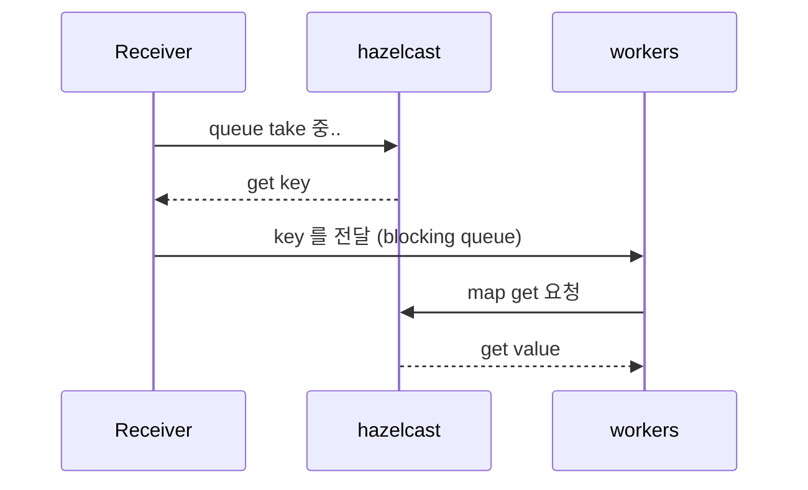

### 2.1 receiver
- message queue 를 기다리고 있는 listener thread group 과 이를 받아서 처리하는 worker thread group 으로 구분할 수 있다.
- listener thread group 과 worker thread group 은 미리 정의된 blocking queue 방식으로 통신하고 있다.
- receiver 는 여러가지 채널에서 응답을 받을 수 있게 구성되어 있으며 (hazelcast, activeMq, Netty) 더 많은 채널을 확장할 수 있는 구조로 만들었다.
- 참고모델: Netty 이벤트 루프, Tomcat Servlet


#### 2.1.1 XReceiver
- 외부 여러 채널에서 받을 수 있는 receiver 를 추상화한 클래스 
- bind, close 2개의 메서드를 가진 각 채널 receiver 등을 구현해서 이를 구체화한다.
- bind 메서드는 warmup 이 끝난 후 자동으로 호출된다.

```java
public interface XReceiver {

    void bind();

    boolean close();
}
```


### 2.1.2 Hazelcast Receiver 
- Hazelcast IQueue, Imap 을 사용한 message queue 방식의 통신을 지원하는 receiver 이다. 
- properties 설정만 으로 Receiver 종류와 내부 수행되는 thread 수를 변경할 수 있다.  

#### 2.1.2.2 hazelcast message queue 특징 
- kafka 와 다르게 hazelcast 는 In-memory 기능 중심으로 만들어진 솔루션으로 queue 에 대량의 데이터를 넣기 보다 이를 IMap과 연동하여 사용
- IQueue에는 적은 데이터이 transaction id만 가지고 있고, 실제 message 는 IMap에서 재조회 하는 방식 




#### 2.1.2.2 application 설정 
- order, risk 라는 2개의 통신 채널을 가지고 있고, 각각 listener, worker thread 갯수도 다르게 설정할 수 있다. 

```yml
allin:
  message: property
  hazelcast:
    receivers:
      - name: order
        listener-count: 2
        worker-count: 5
      - name: risk
        listener-count: 1
        worker-count: 3
```

| properties                 | desc                        | default |
|----------------------------|-----------------------------|---------|
| allin.hazelcast.receivers  | hazelcast receiver array    | N/A     |
| allin.hazelcast.receivers.name | XTarget 과 연결되는 receiver 이름  | N/A     |
| allin.hazelcast.receivers.listener-count | receiver listener thread 갯수 | 1       |
| allin.hazelcast.receivers.worker-count | receiver worker thread 갯수 | 1       |

#### 2.1.2.3 HazelcastXReceiver
- 1 properties 정보에 맞는 XTarget 정보를 가져온다.
- 2 hazelcast IQueue, IMap 정보를 가져온다.
- 3 worker thread 를 등록하고, 그 worker 들이 보고 있는 bq를 반환한다.
- 4 Listener thread 를 등록한다.
```java

@Slf4j
public class HazelcastXReceiver implements XReceiver {

    @Override
    public void bind() {
        HazelcastInstance instance = HazelcastFactory.getInstance();
        for (HzReceiver receiver : hzReceivers.receivers()) {
            createReceiver(receiver, instance);
        }
    }

    private void createReceiver(HzReceiver receiver, HazelcastInstance instance) {
        
        // 1. properties 정보에 맞는 XTarget 정보를 가져온다.
        XTarget xTarget = findXTarget(receiver);
        
        // 2. hazelcast IQueue, IMap 정보를 가져온다.
        IQueue<String> queue = instance.getQueue(xTarget.getQueueName());
        IMap<String , Object> map = instance.getMap(xTarget.getMapName());

        // 3. worker thread 를 등록하고, 그 worker 들이 보고 있는 bq를 반환한다.
        HzMiddleBq hzMiddleBq = registerWorker(receiver, map);

        //4. Listener thread 를 등록한다.
        registerListener(receiver, queue, hzMiddleBq);
    }

    // ... 
    @Override
    public boolean close() {
        return true;
    }
}
```

#### 2.1.2.4 listener thread 등록
- listener thread 는 IQueue 에서 take 메서드를 통해 wait 하고 있다가 message 가 들어오면 이를 처리하는 과정을 반복한다. 
- message 가 들어오게 되면 단순히 worker 들과 통신 방법인 bq에 집어넣는 역할을 하게 된다. 

```java
@Slf4j
public class HazelcastXReceiver implements XReceiver {
    
    // ... 생략
    private void registerListener(HzReceiver receiver, IQueue<String> queue, HzMiddleBq hzMiddleBq) {
        for (int i = 0; i < receiver.listenerCount(); i++) {
            ListenerRunnable listenerRunnable = new ListenerRunnable(i, queue, hzMiddleBq);
            executor.execute(listenerRunnable);
        }
    }

    @Slf4j
    @RequiredArgsConstructor
    static class ListenerRunnable implements Runnable {
        private final int index;
        private final IQueue<String> iQueue;
        private final XBlockingQueue<String> blockingQueue;

        @Override
        public void run() {
            Thread currentThread = Thread.currentThread();
            while (!currentThread.isInterrupted()) {
                try {
                    // IQueue 에서 take 메서드를 통해 wait
                    String takenItem = iQueue.take();
                    // worker 들과 통신 방법인 bq에 집어넣는 역할
                    blockingQueue.put(takenItem);
                } catch (InterruptedException e) {
                    // listener thread 는 인터럽트 발생시 별다른 조치가 필요없다.
                    log.info("{}_{} interrupted ", iQueue.getName(), index);
                    break;
                }
            }
        }
    }
}

```
#### 2.1.2.5 worker thread 등록 
- BlockingQueue 을 wrapping 하여 재정의한 XBlockingQueue 사용하여 worker thread 를 생성한다.
- worker 들은 여기서 정의한 XBlockingQueue 를 wait 하고 있다가 message 가 들어오면 이를 처리하는 과정을 반복한다. 
```java
@Slf4j
public class HazelcastXReceiver implements XReceiver {
    // ... 생략
    private HzMiddleBq registerWorker(HzReceiver receiver, IMap<String, Object> map) {
        HzMiddleBq hzMiddleBq = new HzMiddleBq(1000, receiver.workerCount());
        hzMiddleBq.run(executor, item -> {
            // Imap에서 데이터를 추출한다.
            Object object = map.get(item);
            // dispatcher 를 호출한다.
            xDispatcher.invoke(object);
        });
        return hzMiddleBq;
    }
    
    // BlockingQueue 을 wrapping 하여 재정의한 XBlockingQueue
    static class HzMiddleBq extends AbstractXBlockingQueue<String> {
        public HzMiddleBq(int queueSize, int threadCount) {
            super(queueSize, threadCount);
        }
        @Override
        public void run(XExecutor executor, Consumer<String> consumer) {
            super.run(executor, consumer);
        }
    }
}

```