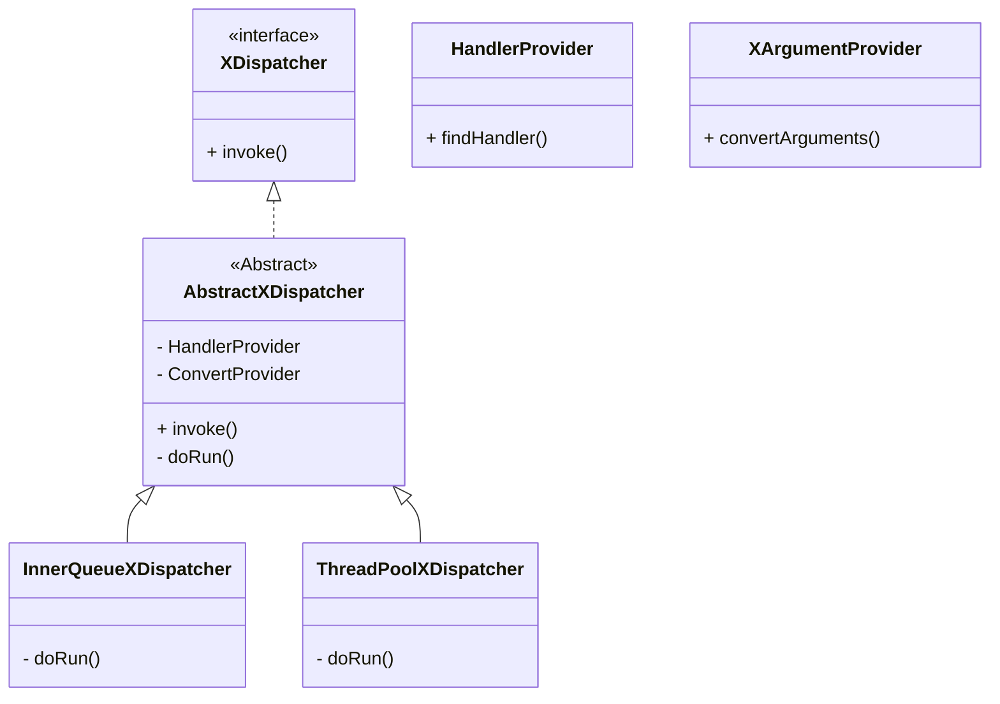

### 2.2 dispatcher
- receiver 에서 받은 요청을 business model 과 연동하기 위한 FrontController 역할을 수행한다.
- Spring DispatcherServlet 처럼 annotation 기반으로 동작되며, HandlerManager, ArgumentResolver 등의 라이브러리도 구현하여 유연하게 business model 을 호출하도록 설계하였다.
- business model 에 thread 가 할당되는 방식은 2가지이며, threadPool 방식과 blockingQueue 방식을 지원한다.
- 참고모델: Spring DispatcherServlet, Tomcat Servlet
- [자세히 보기](document%2Fmd%2F2200_dispatcher.md)


#### 2.2.1 개요
- HTTP protocol 을 사용하지 않기 때문에 Spring MVC(DispatcherServlet) 기능을 사용하지 못하게 됨 
- SI 개발자에게 Thread 직접 생성부터 byte[] 데이터 핸들링 요청을 맡기기에는 부담이 존재
- 그렇다고 switch 문을 통해 각 서비스를 직접 호출하는 방식을 사용하기에는 너무 멋이 없음
- DispatcherServlet 기능을 최대한 유사하게 만들어 Annotation 기반으로 사용할 수 있는 라이브러리를 제공

#### 2.2.2 Custom Annotation 
- Annotation 기반으로 Dispatcher 와 business model 을 연동을 할 수 있게 개발
- Spring 에서 제공하는 @Controller, @RequestMapping, @RequestParam 등을 재해석하여 Custom annotation 을 개발

| custom annotation | Spring annotation | 기능                                   |
|-------------------|-------------------|--------------------------------------|
| @XController      | @Controller       | Business model Handler가 되는 Class 지정  |
| @XMapping         | @RequestMapping   | Business model Handler가 되는 Method 지정 |
| @XParam           | @RequestParam     | Dto가 아닌 객체 변환임을 알려준다.                |
| @XModel| @RequestBody     | Dto 변환 객체인걸 알려주는 어노테이션               |
- Sample 비지니스 모델 
```java
@XController
@Slf4j
@RequiredArgsConstructor
public class OrderController {

    @XMapping("/normal-api")
    public void execute(@XModel FakeXData data, @XParam("url") String url, XHeader header) {
        // .. 생략
    }
}
```


#### 2.2.3 XDispatcher
- XDispatcher 는 receiver 가 알고 있는 유일한 인터페이스이며, 하나의 메서드만 가지고 있는 functional interface 이다
- receiver 에서 이 메서드를 호출하면 business model 프로세스를 다른 thread 가 호출할 수 있게 해주는 기능을 제공한다. 

```java
public sealed interface XDispatcher permits AbstractXDispatcher{
    void invoke(Object item);
}
```




#### 2.2.3 AbstractXDispatcher
- XDispatcher 를 직접 구현할 수 있는 유일한 클래스로 추상 클래스로 지정되어 있다.
- HandlerManager, XArgumentProvider 를 통해 Business model 을 호출할 수 있는 사전 준비를 하는 기능은 공통으로 사용한다.
- template method 패턴으로 하위 클래스에게 business model 호출 방식만 위임한다.
```java

public abstract non-sealed class AbstractXDispatcher implements XDispatcher {

    // ... 생략

    @Override
    public void invoke(Object item) {

        // 1. 전달 받은 데이터를 allin 시스템에서 사용할 수 있는 XRequest 로 변환한다.
        //    여기서 전달받은 데이터는 여러가지 형태가 존재할 수 있다.
        //    Serializable or JsonByte, JsonString
        //    전달받을 데이터의 형태가 추가되어도 기존 코드의 변경을 없게 하기 위해 convert 를 추상화 한다.
        XRequest xRequest = new XRequest((byte[]) item);
        //System.out.println("xRequest = " + xRequest);

        // 2. business model 을 찾을 수 있어야 한다.
        //    http 의 경우 url 로 맵핑 하지만 여기서는 apiName = url 이라 가정하고 받을 수 있게 한다.
        XHandler handler = handlerManager.findHandler(xRequest.url());

        // 3. argumentResolver 기능을 통해 business model 에서 사용하려고 하는 메서드 인자값을 변환하는 기능을 추가한다.
        //    마찬가지로 하위 단계에서도 설정 가능하게 한다.
        Object[] arguments = XArgumentProvider.convertArguments(handler, xRequest);

        // 4. business model 과 연동시 다양한 방법으로 사용할 수 있게 template method 패턴으로 하위 클래스에 위임한다.
        try {
            doRun(handler, arguments);
        } catch (RuntimeException e) {
            log.error("처리할 수 없는 exception 발생하였습니다. ", e);
        }
    }

    protected abstract void doRun(XHandler handler, Object[] arguments);
}
```
- 1 전달 받은 데이터를 allin 시스템에서 사용할 수 있는 XRequest 로 변환한다
- 2 XRequest 를 통해 business model 을 찾을 수 있어야 한다.
- 3 argumentResolver 기능을 통해 business model 에서 사용하려고 하는 메서드 인자값을 변환하는 기능을 추가한다.
- 4 business model 과 연동시 다양한 방법으로 사용할 수 있게 template method 패턴으로 하위 클래스에 위임한다.


#### 2.2.4 VirtualThreadDispatcher
- receive 에 message 가 도착할 때마다 virtual thread 를 생성하여 business model 을 호출한다. 
- virtual thread 는 생성비용이 크지 않아 pool 을 사용하기 보다는 semaphore 를 사용해서 비지니스 트래픽을 조절한다. 

```java

@Slf4j
public class VirtualThreadDispatcher extends AbstractXDispatcher {
    
    // .. 생략
    @Override
    protected void doRun(XHandler handler, Object[] arguments) {
        try {
            this.semaphore.acquire();
            executor.execute((new VirtualThreadRunnable(handler, arguments, semaphore)));
        } catch (InterruptedException e) {
            throw new RuntimeException(e);
        }
    }

    @RequiredArgsConstructor
    static class VirtualThreadRunnable implements Runnable {

        private final XHandler handler;
        private final Object[] arguments;
        private final Semaphore semaphore;

        @Override
        public void run() {
            try {
                handler.method().invoke(handler.bean(), arguments);
            } catch (IllegalAccessException e) {
                log.error("virtualThreadDispatcher 요청에 실패했습니다. ", e);
            } catch (InvocationTargetException ignored) {
                // exception advice 를 통해 처리되는 부분이 있어 발생하지 않음
                log.error("business model 수행중에 애러가 발생하였습니다. ", ignored);
            } finally {
                semaphore.release();
            }
        }
    }
}
```


#### 2.2.5 BlockingQueueThreadDispatcher


#### 2.2.6 X-protocol
- Http 방식으로 전달하지 않기에 먼저 전문 형태를 정의해야 된다. 
- 길이가 고정된 fixed-length 방식을 사용하기 싫고, 그렇다고 Http 방식도 사용할 수 없기에 새로운 protocol을 정의해서 처리한다. 
```text
url=/normal-api // (1)
transactionId=778a8f3e-7ae9-4cdc-9d74-832e07b18f8c // (2)
contentType=JSON // (3)
contentLength=39 // (4)
// (5)
{"username":"kimtaehan\nTest","age":30} // (6)
```
- (1) ~ (4) 까지 header 데이터로 확장성을 위해 필요에 따라 추가할 수 있는 구조이다.
- header 는 `=` 구분자로 key, value 를 구분하지만 header 데이터가 사용될지는 클라이언트~서버 간에 알아서 선택하는 방식이다.
- (5) header, body 를 구분하기 위한 \n 을 하난 입력한다. 
- (6) 나머지는 전부 body 데이터이며, contentType에 따라 알아서 입력하자 (여기서는 json 형태로 body를 사용한다)


#### 2.2.7 XRequest
- HttpServletRequest 객체를 대체하는 클래스이다. Http 프로토콜이 아닌 새로운 X-protocol 을 정의한다. 
- 외부에서 x-protocol 데이터를 변경하여 담을 수 있는 그룻을 만들었다.  
- 현재는 JSON 형태의 body만 입력 가능하지만 구조 변경없이 다른 형태의 데이터도 받을 수 있는 구조로 만들고 싶어 아래의 형태로 데이터를 받는다.
```java
public class XRequest {

    private final Map<String, String> headers = new HashMap<>();

    private byte[] body;
    
    // ... 생략
}
```

#### 2.2.8 Handler Manager
- 요청받은 XRequest 객체를 어떤 Business model handler 가 처리 할 수 있는지 알려주는 기능을 제공한다.
- 현재는 어노테이션 기반으로만 등록이 가능하다 (Spring과 유사한 구조)
- [자세히보기](2280_handler.md)
 

#### 2.2.9 argument resolver 
- business model handler(method)를 호출하기 위해 필요한 파라메터(argument) 값을 구하는 기능을 제공한다.
- method 의 시그니처를 분석하여 파라메터들이 원하는 값을 Object[] 형태로 반환해서 메서드를 호출할 수 있게 해준다. 
- [자세히보기](2290_argument_resolver.md)