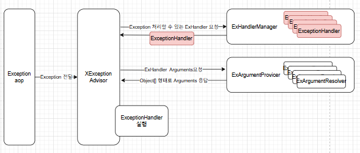

### 2.4 exception advice
- business model 을 처리하다가 예외를 핸들링 하기위해 try/catch 문을 사용하여 exception 을 처리할 수 있지만 이는 비효율적인 코드를 유발하게 된다.
- XExceptionAdvice 는 allin system business model 에서 exception 발생시 이를 Client 에 나가기 전에 잡아서 처리할 수 있는 프로세스이다.
- Spring Web application 에서는 ControllerAdvice 라는 이름으로 비슷한 기능을 제공하고 있다.
- 참고모델: Spring ControllerAdvice, ExceptionHandler 


#### 2.4.1 아키텍처
- `ExceptionAdviceAspect` 는 aop 로 @XMapping, @XBlockingQueueMapping 를 사용하는 method 를 proxy 객체를 통해 호출하도록 한다. 
- business model 에서 exception 이 발생하고 이를 catch 하지 않은 경우 aop proxy 객체에서 catch 하여 exception advice 를 호출한다.

#### 2.4.2 ExceptionAdviceAspect
- @XMapping, @XBlockingQueueMapping 어노테이션을 선언한 메서드를 호출하기전에 앞에 proxy 객체를 두는 aop 를 적용하였다. 
- business model 수행도중 제어하지 않은 예외가 발생한 경우 `XExceptionAdvisor` run 메서드를 호출한다. 


```java
@Aspect
@RequiredArgsConstructor
public class ExceptionAdviceAspect {

    private final XExceptionAdvisor xExceptionAdvisor;

    @Pointcut("@annotation(develop.x.core.dispatcher.annotation.XMapping)")
    public void xMapping(){}

    @Pointcut("@develop.x.core.blockingqueue.annotation.XBlockingQueueMapping)")
    public void xBlockingQueueMapping(){}

    @Around("xMapping() || xBlockingQueueMapping")
    public Object processCustomAnnotation(ProceedingJoinPoint joinPoint) throws Throwable {
        try{
            return joinPoint.proceed();
        } catch (Exception exception){
            // Exception advice handler 중에 처리할 수 있는 handler 가 있는지 확인한다.
            if (!xExceptionAdvisor.run(exception, joinPoint.getArgs())) {
                log.error("처리하지 못한 예외가 발생했습니다.", exception);
                throw new RuntimeException("Exception advice 로 처리되지 못한 애러", exception);
            }
            return null;
        }
    }
}
```

#### 2.4.3 XExceptionAdvisor
- XExceptionAdvisor 는 Exception Aop 에서 애러를 전달했을 때, 이는 처리할수 있는 Exception Handler 를 찾아 호출하는 역할을 수행한다.
- XExceptionAdvisor 는 Exception 을 처리하기 위한 부가적인 프로세스임으로 여기 자체에서 발생한 애러는 무시한다. 


```java
@Slf4j
public class XExceptionAdvisor {
    // ... 생략
    public boolean run(Throwable throwable, Object[] args) {
        try {
            // (1) 현재 발생한 Throwable 을 처리할 수 있는 exception handler 를 찾는다.
            ExceptionHandler exceptionHandler = exceptionHandlerManager.find(throwable.getClass());
            // (2) exception handler 에서 필요한 파라메터 데이터를 생성한다.
            Object[] params = xExArgumentProvider.convertArguments(exceptionHandler, throwable, args);
            // (3) java reflection 을 사용해 exception handler 를 호출한다.
            return callReflectionMethod(exceptionHandler, params);
        } catch (IllegalArgumentException e) {
            log.error(e.getMessage(), e);
            return false;
        }
    }
       
}
```
- XExceptionAdvisor.run 수행 과정
    - (1) 현재 발생한 Throwable 을 처리할 수 있는 exception handler 를 찾는다.   
    - (2) exception handler 에서 필요한 파라메터 데이터를 생성한다.
    - (3) java reflection 을 사용해 exception handler 를 호출한다.

#### 2.4.4 ExceptionHandler
- Throwable 발생하였을 때 이를 처리할 수 있는 Exception Handler 를 의미한다. 



##### 2.4.4.1 custom annotation 
- 상속으로 처리할 수도 있지만, custom annotation 을 통해 조금 더 유연한 방식으로 ExceptionHandler 등록하는 방법을 제공한다. 
- @XExAdvice, @XExHandler 를 통해 특정 class 특정 method 를 ExceptionHandler 로 등록할 수 있다. 
- @XExAdvice 선언한 class 는 ExceptionHandler 를 등록할 수 있는 class 가 되며, ExAdviceOrder 를 통해 우선순위를 지정할 수 있다. 
- @XExHandler 선언한 method 는 ExceptionHandler 로 호출되는 method 가 지정되며 Throwable 를 배열형태로 N건 등록할 수 있다.
```java
@Retention(RetentionPolicy.RUNTIME)
@Target({ElementType.TYPE})
public @interface XExAdvice {
    ExAdviceOrder value() default ExAdviceOrder.BUSINESS;
}

@Retention(RetentionPolicy.RUNTIME)
@Target({ElementType.METHOD})
public @interface XExHandler {
    Class<? extends Throwable>[] value();
}
```

##### 2.4.4.2 core 에서 제공하는 ExceptionHandler
- allin core 에서도 몇가지 exception handler 를 제공하고 있다. 
- IllegalArgumentException, IllegalStateException, RuntimeException 에 대한 예외처리를 지원하고 있다.
- business model 에서 위의 exception 발생시 `CoreXExceptionAdvice` class 의 해당 메서드가 호출되어 후속 처리를 지원하고 있다.
```java
@Slf4j
@XExAdvice(ExAdviceOrder.SYSTEM)
public class CoreXExceptionAdvice {

    @XExHandler({IllegalArgumentException.class, IllegalStateException.class})
    public void illegalXXXExAdviceHandler(RuntimeException runtimeException, @XExParam("message") String message) {
        // 후속 처리
    }

    @XExHandler({RuntimeException.class})
    public void runtimeExAdviceHandler(RuntimeException runtimeException) {
        // 후속 처리
    }
}
```

##### 2.4.4.3 ExAdviceOrder
- `ExAdviceOrder`는 Exception advice 의 순서를 정하기 위해 인덱싱 class 이며, System에서 지정한 내용보다 business ExHandler의 우선순위를 높이기 위해서 사용된다. 
- @XExAdvice 어노테이션의 인자로 등록될 수 있고, default 는 BUSINESS 이다. 
```java
@RequiredArgsConstructor
public enum ExAdviceOrder {
    SYSTEM(3), BUSINESS(2), FIRST(1),
    ;

    @Getter
    private final int index;
}
```


#### 2.4.5 ExceptionHandlerManager
- 앞에서 등록된 ExceptionHandler 들을 bean 생성시점부터 관리하고, `XExceptionAdvisor` 요청시 Exception 에 맞는 Ex Handler 를 알려주는 역할을 수행한다. 


```java
public class ExceptionHandlerManager {

    private final Collection<ExceptionHandler> xExceptionAdvices;

    public ExceptionHandlerManager(ApplicationContext context) {
        this.xExceptionAdvices = Collections.unmodifiableCollection(initializeAdvices(context));
    }

    // (1) 서버시작시에 bean 으로 등록된 ExceptionHandler 를 수집하여 Collection 객체에 저장한다.
    private Collection<ExceptionHandler> initializeAdvices(ApplicationContext context) {
        return createExceptionAdviceMap(context.getBeansWithAnnotation(XExAdvice.class).values())
                .stream()
                .sorted(this::compareAdvice)
                .toList();
    }
    
    // ... 생략
    // (2) 발생한 Exception class 를 처리할 수 있다. ExceptionHandler 를 리턴한다.
    public ExceptionHandler find(Class<? extends Throwable> throwable) {
        for (ExceptionHandler exceptionHandler : xExceptionAdvices) {
            if (exceptionHandler.throwable().isAssignableFrom(throwable)) {
                return exceptionHandler;
            }
        }
        throw new IllegalArgumentException("ex handler 를 찾을 수 없습니다. " + throwable.getSimpleName());
    }
}
```
- (1) 서버시작시에 bean 으로 등록된 Exception handler 들을 수집하여 Collection 객체에 저장한다.
- (2) 발생한 Exception class 를 처리할 수 있다. ExceptionHandler 를 리턴한다.

##### 2.4.5.1 ExceptionHandler 우선순위 및 예외조건
- 동일한 exception 을 처리하는 handler 가 여러개 일수 는 없다. (단 System 에 정의 된 Throwable handler 는 재정의 할 수 있다.)
- 자신의 exception 을 처리하는 handler 가 없는 경우 상위 클래스의 handler 를 순차적으로 올라가면서 찾는다.
- `@XExceptionHandler` annotation 에 정의된 Throwable 는 method 파라메터에 속한 Throwable 여야 한다.
- exception 의 자신의 handler 와 부모 handler 가 모두 있는 경우 작은 범위 부터 우선순위를 가져가 자신의 handler 가 호출된다.


#### 2.4.6 Exception Resolver
- exception advice handler(method)를 호출하기 위해 필요한 파라메터(argument) 값을 구하는 기능을 제공한다.
- method 의 시그니처를 분석하여 파라메터들이 원하는 값을 Object[] 형태로 반환해서 메서드를 호출할 수 있게 해준다.


##### 2.2.9.1 XExArgumentResolver
- Spring 에 ArgumentResolver 를 대체하는 XArgumentResolver 는 business model handler 를 처리하기 위한 파라메터 변환을 할 수 있게 해주는 인터페이스이다.
- support, convert 2개의 메서드만 존재하며, 이를 구현해서 추가적인 XExArgumentResolver 를 만들 수 있다.
- (1) java.lang.reflect.Parameter 객체를 전달받아 해당 파라매터를 변환할 수 있는지 알려준다.
- (2) Throwable 와 메서드 파라메터 데이터를 java.lang.reflect.Parameter 객체가 원하는 type으로 변경한다.


```java
public interface XExArgumentResolver {

    boolean support(Parameter parameter);

    Object convert(Throwable throwable, Object[] args);
}
```

##### 2.2.9.2 Core 에서 기본으로 제공하는 XExArgumentResolver
- Spring 에서 그렇듯 공통적으로 많이 사용하는 type은 기본적으로 제공하고 있다.

| XExArgumentResolver         | 설명                                                   |
|---------------------------|------------------------------------------------------| 
| ThrowableExArgumentResolver      | Throwable 하위 클래스 객체를 받을 수 있다.                        |
| MessageExArgumentResolver | 발생한 Throwable 에 메시지를 String 타입으로 받을 수 있다.            |
| ArgumentsExArgumentResolver    | business model 에서 사용하는 메서드의 아규먼트들을 Object[] 형태로 받는다. |
| NullableExArgumentResolver | 다른 XExArgumentResolver 가 변환할 수 없는 형태인 경우 null 을 반환한다.  |


###### 2.2.9.2.1 ThrowableExArgumentResolver
- 발생한 Exception (Throwable 상속받은 class) 객체를 받을 수 있다.
- 조건: Parameter 의 type 이 Throwable 포함한 하위 클래스인경우
- 반환타입: 발생한 Throwable 객체 

```java
public class ThrowableExArgumentResolver implements XExArgumentResolver {

    @Override
    public boolean support(Parameter parameter) {
        return Throwable.class.isAssignableFrom(parameter.getType());
    }

    @Override
    public Object convert(Throwable throwable, Object[] args) {
        return throwable;
    }
}
```

###### 2.2.9.2.2 MessageExArgumentResolver
- 발생한 Exception 에서 제공하는 message 를 받을 수 있다.
- 조건: Parameter 의 type 이 String 이고, `@XExParam` 어노테이션을 가지고 그 value 가 ("message", "msg") 에 포함되는 경우
- 반환타입: String

```java
public class MessageExArgumentResolver implements XExArgumentResolver {

    private final Set<String> argumentNames = Set.of("message", "msg");

    @Override
    public boolean support(Parameter parameter) {
        if (String.class.equals(parameter.getType()) && parameter.getAnnotatedType().isAnnotationPresent(XExParam.class)) {
            XExParam xExParam = parameter.getAnnotatedType().getAnnotation(XExParam.class);
            return argumentNames.contains(xExParam.value().toLowerCase());
        }
        return false;
    }

    @Override
    public Object convert(Throwable throwable, Object[] args) {
        return throwable.getMessage();
    }
}
```

###### 2.2.9.2.3 ArgumentsExArgumentResolver
- 발생한 business model 에서 사용하는 메서드의 아규먼트들을 Object[] 형태로 받는다
- 조건: Parameter 의 type 이 Object[] 인 경우
- 반환타입: Object[]

```java
public class ArgumentsExArgumentResolver implements XExArgumentResolver {

    @Override
    public boolean support(Parameter parameter) {
        return Object[].class.isAssignableFrom(parameter.getType());
    }

    @Override
    public Object convert(Throwable throwable, Object[] args) {
        return args;
    }
}
```

###### 2.2.9.2.4 NullableExArgumentResolver
- 다른 ExArgumentResolver 가 변환할 수 없는 형태인 경우 null 을 반환한다.
- 조건: 없음
- 반환타입: null

```java
public class NullableExArgumentResolver implements XExArgumentResolver {

    @Override
    public boolean support(Parameter parameter) {
        return false;
    }

    @Override
    public Object convert(Throwable throwable, Object[] args) {
        return null;
    }
}
```


#### 2.4.7 XExArgumentProvider
- `ExceptionAdviceAspect`에게 `ExceptionHandler`, Throwable, arguments 를 받아서  Method 를 호출하기 위한 argument 들을 Object[] 형태로 반환해준다.


```java
public class XExArgumentProvider {

    private final List<XExArgumentResolver> resolvers;
    private final XExArgumentResolver defaultResolver = new NullableExArgumentResolver();

    public XExArgumentProvider(ApplicationContext context) {
        // (1) bean 이 생성될 때 XExArgumentResolver 를 구현한 bean 들을 가져온다.
        resolvers = context.getBeansOfType(XExArgumentResolver.class)
                .values().stream()
                .toList();
    }

    public Object[] convertArguments(ExceptionHandler exceptionHandler, Throwable throwable, Object[] args) {
        Parameter[] parameters = exceptionHandler.method().getParameters();
        List<Object> result = new ArrayList<>();
        // (2) method parameters 를 반복해서 변환요청을 한다.
        for (Parameter parameter : parameters) {
            // (2-1) parameter 를 변환할 수 있는 ArgumentResolver 를 찾는다.
            XExArgumentResolver resolver = findArgumentResolver(parameter);
            // (2-2) 찾은 ArgumentResolver 에게 변환 요청을 하고 그 결과를 저장한다.
            result.add(resolver.convert(throwable, args));
        }
        // (3) 요청한 클라이언트에 Object[] 결과를 반환한다. 
        return result.toArray();
    }


    private XExArgumentResolver findArgumentResolver(Parameter parameter) {
        for (XExArgumentResolver resolver : resolvers) {
            if(resolver.support(parameter)){
                return resolver;
            }
        }
        return defaultResolver;
    }
}
```
- (1) bean 이 생성될 때 XExArgumentResolver 를 구현한 bean 들을 가져온다.
- (2) method parameters 를 반복해서 변환요청을 한다.
  - (2-1) parameter 를 변환할 수 있는 ArgumentResolver 를 찾는다.
  - (2-2) 찾은 ArgumentResolver 에게 변환 요청을 하고 그 결과를 저장한다.
- (3) 요청한 클라이언트에 Object[] 결과를 반환한다. 