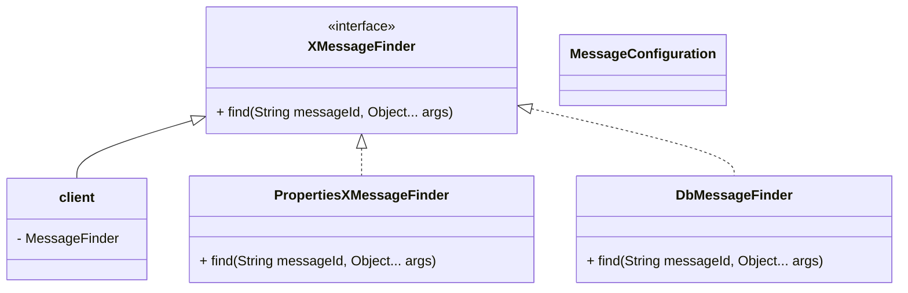

### 2.6 message finder
- 미리 정의된 message 를 읽고 싶은 경우 사용하는 message finder 를 추상화를 통해 실제 구현체에 따라 변경할 수 있도록 만들었다.
- Allin System 에서는 message 를 읽는 방법이 2가지 존재할 수 있다. (properties or database)

#### 2.6.1 architecture
- `PropertyMessageFinder`, `DbMessageFinder` 는 자신의 방법으로 `XMessageFinder` 의 find 를 구현하고 있다.
- Client 는 MessageFinder 라는 추상화된 inteface를 의존하고 있으며 실제 구현체는 알지 못한다.
- application.yml 설정에 따라 `MessageConfiguration` 에서 실제 구현체를 주입한다.

#### 2.6.1 XMessageFinder Class diagram


#### 2.6.2 XMessageFinder
- XMessageFinder 에는 `find`라는 method 만 존재한다. Locale 설정은 default 설정인 한글을 지원하도록 자바 11에서 지원한 default 메서드를 통해 사용할 수 있게 만들었다.
- 기본적으로 messageId와 동적으로 변경될 수 있는 args 에 따라 메시지를 만들어 Optional<String> 타입으로 리턴받는다.
```java
public interface XMessageFinder {
    default Optional<String> find(String messageId, Object... args) {
        return find(messageId, Locale.KOREA, args);
    }
    Optional<String> find(String messageId, Locale locale, Object... args);
}
```

#### 2.6.3 PropertiesXMessageFinder
- Spring 에서 지원하는 MessageSource 를 이용하여 properties 에 있는 데이터를 조회하는 형태이다. 
- [테스트 코드](..%2F..%2Fallin-core%2Fsrc%2Ftest%2Fjava%2Fdevelop%2Fx%2Fcore%2Fmessage%2FPropertiesXMessageFinderTest.java)
```java
@Slf4j
public class PropertiesXMessageFinder implements XMessageFinder {

    private final MessageSource messageSource;

    public PropertiesXMessageFinder(MessageSource messageSource) {
        this.messageSource = messageSource;
    }

    @Override
    public Optional<String> find(String messageId, Locale locale, Object... args) {
        try {
            return Optional.of(messageSource.getMessage(messageId, args, locale));
        } catch (NoSuchMessageException noSuchMessageException) {
            log.error("properties 에 정의된 메시지를 찾지 못했습니다. {}", messageId, noSuchMessageException);
            return Optional.empty();
        }
    }
}
```
- properties 설정 message.properties
```properties
HELLO_ALLIN=안녕! {0}!
```


#### 2.6.4 DatabaseXMessageFinder
- Database 를 통해 메시지를 읽어오는 부분이다. (미구현)
- 필요에 따라 추가적인 방법으로 메시지를 읽어오는 구현체를 변경할 수 있다. 


#### 2.6.5 MessageConfiguration
- @AutoConfiguration 를 통해서 XMessageFinder bean 을 주입하는 구조인데 yaml 파일에 설정에 따라 propertyMessageFinder, DatabaseXMessageFinder 중에 하나가 구현체로 등록되는 것을 확인할 수 있다.

```java
@AutoConfiguration
public class MessageConfiguration {

    @Bean
    @ConditionalOnProperty(value = "allin.message", havingValue = "property", matchIfMissing = true)
    public XMessageFinder propertyMessageFinder(MessageSource source){
        return new PropertiesXMessageFinder(source);
    }

    @Bean
    @ConditionalOnProperty(value = "allin.message", havingValue = "database", matchIfMissing = false)
    public XMessageFinder dbMessageFinder(MessageSource source){
        return new DatabaseXMessageFinder();
    }
}
```
- application.yml
```yaml
allin:
  message: property
```