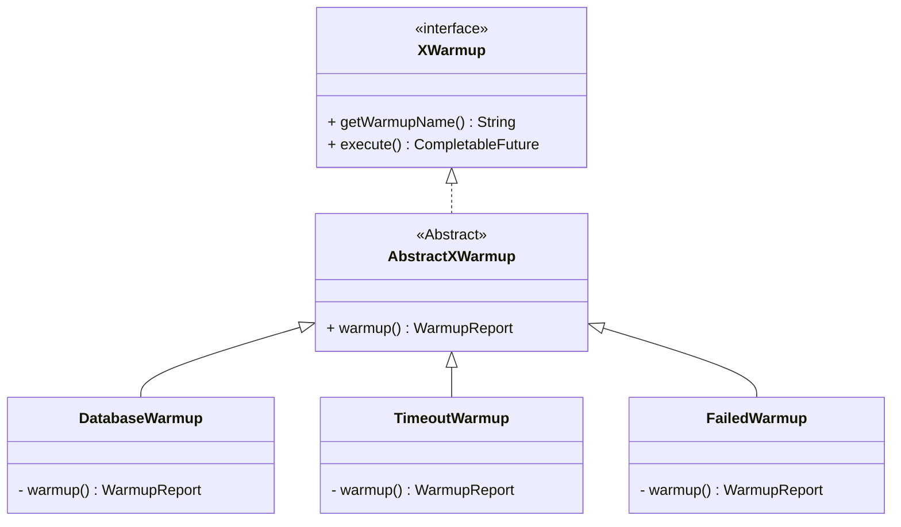

### 3.2 warmup 하고 시작하기
- allin 시스템은 아직 준비가 되지 않았는데, 외부 요청 트래픽은 미리 들어와서 기다리고 있는 현상이 발생하였다.
- 만약 여러대의 서버에서 동일한 어플리케이션을 처리한다면, 다른 서버에서 처리할 수 있는 요청에 대한 지연이 발생할 수 있게 된다.

#### 3.2.1 요구사항 정리 
- 요구 사항 1: 웜업 기능이 완료된 후 트래픽을 받을 수 있어야 한다.
- 요구 사항 2: 로컬 환경에서는 웜업 기능이 작동할 필요가 없으므로 선택해서 실행할 수 있어야 한다.
- 요구 사항 3: 프레임워크를 지원하는 구조로 구현한다.
- 요구 사항 4: 웜업은 한 번만 실행한다.
- 요구 사항 5: 새로운 웜업을 쉽게 추가할 수 있어야 한다. 
- 요구 사항 6: 웜업 프로그램은 병렬로 수행되어야 한다. 
- 요구 사항 7: 특정 시간안에 모든 작업이 종료되어야 하고, 그시간동안 못한 경우 Timeout 을 표시해야 된다.

#### 3.2.2 스프링 부트 애플리케이션 초기화
- 스프링 부트는 애플리케이션 구동 시점에 코드를 실행시킬 수 있는 몇 가지 방법을 제공한다.
- CommandLineRunner, ApplicationRunner, ApplicationReadyEvent
- 작동순서: ApplicationRunner ->  CommandLineRunner -> ApplicationReadyEvent 로 실행된다.

##### 3.2.2.1 CommandLineRunner
- CommandLineRunner를 구현한 구현체는 컴포넌트 스캔이 되고, 스프링부트가 구동되는 시점에 run() 메소드를 실행하게 됩니다.
- 이때 run 메소드 안의 ...args는 스프링 부트 구동시 실행 인자가 있다면, 받아서 처리하게 됩니다.
```java
@Component
public class DataLoader implements CommandLineRunner {
    private final MemberRepository memberRepository;

    public DataLoader(final MemberRepository memberRepository) {
        this.memberRepository = memberRepository;
    }

    @Override
    public void run(final String... args) throws Exception {
        memberRepository.save(new Member("unluckyjung"));   // 초기에 삽입할 데이터
    }
}
```

##### 3.2.2.2 ApplicationRunner
- CommandLineRunner 인터페이스와 다른 점은 파라미터가 다르다. String이 아닌 ApplicationArguments 인터페이스를 받는다.
- CommandLineRunner는 1.0.0 버전에서 등장했고, ApplicationRunner는 1.3.0 버전에서 추가됐다. 
```java
@Component
public class MyApplicationRunner implements ApplicationRunner {
	@Override
	public void run(ApplicationArguments args) throws Exception {
		System.out.println("ApplicationRunner!");
	}
}
```

##### 3.2.2.3 ApplicationReadyEvent
- 스프링 프레임워크는 애플리케이션이 구동되어 서비스 요청을 받을 준비가 되었을 때 ApplicationReadyEvent 이벤트를 발생한다. 
- 따라서 @EventListener를 같이 사용하면 구동이 완료됐을 때 코드를 실행할 수 있다.
```java
public class WarmupListener implements ApplicationListener<ApplicationReadyEvent> {

    @Override
    public void onApplicationEvent(ApplicationReadyEvent event) {
        // warm up
    }
}
```

#### 3.2.3 XWarmup
- warmup 프로그램을 계속하고 추가하여도 기존 소스는 변경없고, warmup 프로그램이 병렬로 수행될 수 있게 추상화 인터페이스를 구현 
- execute: 결과를 CompletableFuture 로 받아 병렬로 처리될 수 있게 하였다.

```java
public sealed interface XWarmup permits AbstractXWarmup {

    String getWarmupName();

    CompletableFuture<WarmupReport> execute();
}
```




#### 3.2.3 AbstractBetWarmup
- warm up 프로그램들에 공통적인 작업을 위한 abstract class (텝플릿 메서드 패턴 활요) 
- CompletableFuture 를 사용하여 타임아웃 존재하는 비동기 작업, 소요시간 체크
- gkdnl warm up 프로그램은 warmup 메서드로 WarmupReport 만 구성해주면 된다.

```java
public non-sealed abstract class AbstractXWarmup implements XWarmup {

    private static final int TIME_OUT = 3;

    @Override
    public String getWarmupName() {
        return this.getClass().getSimpleName();
    }

    @Override
    public CompletableFuture<WarmupReport> execute() {

        long startTime = System.currentTimeMillis();
        return CompletableFuture.supplyAsync(() -> warmup(startTime))
                .orTimeout(TIME_OUT, TimeUnit.SECONDS)
                .exceptionally(ex -> {
                    log.info("test = {}", ex.getClass());
                    log.info("test = {}", ex.getMessage());
                    return WarmupReport.builder()
                            .jobName(getWarmupName())
                            .warmupResult(ex instanceof TimeoutException ? WarmupResult.TIMEOUT: WarmupResult.FAIL)
                            .duration(System.currentTimeMillis() - startTime)
                            .build();
                });
    }

    private WarmupReport warmup(long startedTime) {
        WarmupReport warmup = warmup();
        warmup.updateTime(startedTime);
        return warmup;
    }

    protected abstract WarmupReport warmup();

}
```

#### 3.2.4 하위 클래스 샘플
- 실제 warm up 하는 클래스 `AbstractBetWarmup` 를 상속받아 `WarmupReport`로 결과를 전달해주면 된다. 
- 내부적으로 타임아웃이나 비동기 처리는 공통 영역에서 처리한다.
```java
public class FailedWarmup extends AbstractXWarmup{
    @Override
    protected WarmupReport warmup() {
        return new WarmupReport(getWarmupName(), WarmupResult.FAIL);
    }
}
```

#### 3.2.5 WarmupListener
- XWarmup 에서는 ApplicationReadyEvent 를 통해서 Springboot 기동시에 warmup 이벤트를 수행한다. 
- XWarmup 빈으로 등록된 warm up 프로그램을 찾아 수행하고 그 결과를 출력한다.

```java
public class WarmupListener implements ApplicationListener<ApplicationReadyEvent> {

    private final Collection<BetWarmup> beans;
    public WarmupListener(ApplicationContext context) {
        this.beans = context.getBeansOfType(BetWarmup.class).values();
    }

    @Override
    public void onApplicationEvent(ApplicationReadyEvent event) {
        // warm up
        log.info("betting system warm up start..");
        List<CompletableFuture<WarmupReport>> jobs = beans.stream().map(BetWarmup::execute).toList();

        // 모든 작업이 완료되었을 때 결과를 처리합니다.
        CompletableFuture.allOf(jobs.toArray(new CompletableFuture[0])).thenRun(() -> {
            List<WarmupReport> results = jobs.stream()
                    .map(CompletableFuture::join) // join()으로 각 작업 결과 가져오기
                    .toList();
            results.forEach(result ->
                    log.info(result.toString())
            );

        }).join(); // 메인 스레드가 모든 작업이 끝날 때까지 기다림
        log.info("betting system warm up end..");
    }
}
```

- log 출력 내용
```text
betting system warm up start..
{jobName='DatabaseWarmup', warmupResult=SUCCESS, duration=1007ms}
{jobName='FailedWarmup', warmupResult=FAIL, duration=1ms}
{jobName='TimeoutWarmup', warmupResult=TIMEOUT, duration=3017ms}
betting system warm up end..
```
