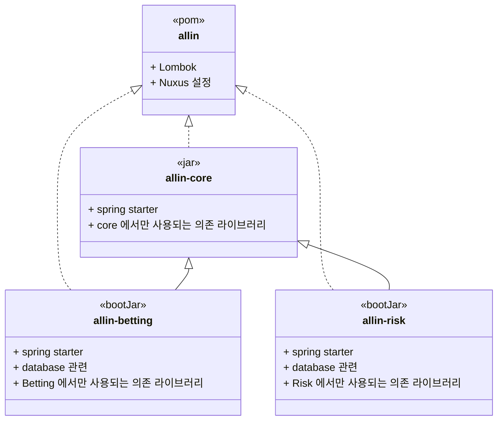

### 3.3 멀티 모듈을 사용하기
- allin 시스템은 상호 연결된 여러개의 process 를 만들어야 하고, 이를 하나의 프로젝트에 관리하는 것이 훨씬 편한 방법이라 멀티모듈을 도입하였다.
- java 에서 module 은 package 한 단계 위에 집합체이며, 관련된 패키지와 리소스를 재사용할 수 있고, 독립적으로 개발, 빌드, 테스트, 배포가 가능하다.
- multi module project 는 상호 연결된 여러 개의 module 로 구성된 프로젝트를 의미한다.
- 
#### 3.1.1 multi module 장점
- 공통의 코드는 의존성을 추가하여 코드의 중복을 줄일 수 있다. 
- 각 module 은 기능을 분리하여 코드의 이해가 빨라진다.
- 여러 module 에 대한 빌드를 쉽게 할 수 있다. 

#### 3.1.2 module 별 속성
- allin system 에서 필요에 의해 아래와 같이 module 을 구분 할 수 있는 속성을 정의 하였다.

| 속성| 빌드 결과               | 설명                                |
| --|---------------------|-----------------------------------|
| pom| n/a                 | maven 의 외부 라이브러리 설정을 상속할 수 있다     |
|jar| jar | 직접 수행은 불가하지만 jar 파일로 의존성을 가질 수 있다 |
|bootJar| executable jar| spring boot 시스템을 수행할 수 있다         |                 

#### 3.1.2  Bet System Multi module 구조
- 실제 프로젝트에서는 더 복잡한 관계로 연관이 되어 있지만 여기서는 간단하게만 표현
- bootJar 표현된 module 은 실제 jvm 위에서 수행되는 프로그램이다.

