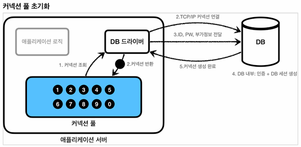
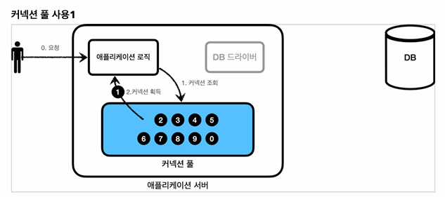
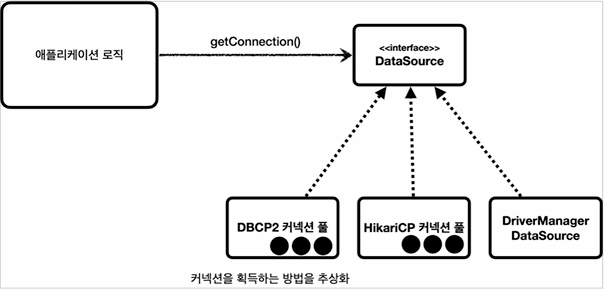
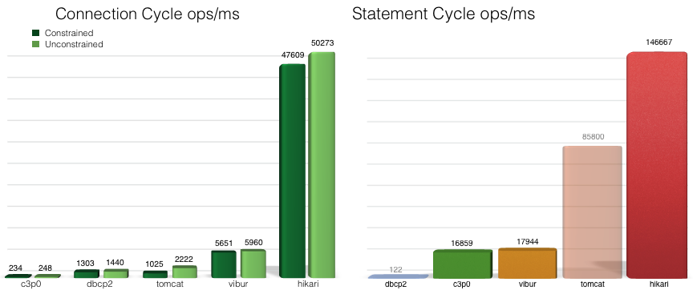

### 3.9 Database connection pool (DBCP)
- Database Connection Pool 의 약자이다. 요청이 올때마다 Connection 객체를 얻는 것이 아닌, 미리 일정 갯수 찍어내서 Connection Pool 로 관리하는 것이다
- application 이 실행되면 미리 일정량은 DB Connection 객체를 생성하고, pool 이라는 공간에 저장한다.


- 요청에 따라 필요시에 pool 에서 connection 객체를 가져다 쓰고 반환한다.



#### 3.9.1 Datasource 
- java 에서는  커넥션을 획득하는 방법을 추상화 하는 인터페이스를(javax.sql.DataSource) 제공한다.

```java
public interface DataSource {
    Connection getConnection() throws SQLException;
    // ... 생략
}
```


#### 3.9.2 DBCP 종류
- 자바에서 유명하고 대표적인 DBCP 는 Commons DBCP, Tomcat DBCP, HikariCP가 있다. 
- 아래 그림은 HikariCP가 제공한 성능 표이기에 HikariCP가 유리한 측면이 있다.



##### 3.9.2.1 Apache Commons
- 아파치에서 제공해 주는 우리가 알고 있고 많이 사용하는 대표적인 Connection Pool 라이브러리.
- http://commons.apache.org/proper/commons-dbcp/

##### 3.9.2.2 Tomcat DBCP
- Tomcat에서 내장되어 사용하고 있으며 Apache Commons DBCP 라이브러리를 바탕으로 만들어졌다.
- https://tomcat.apache.org/tomcat-8.5-doc/jndi-datasource-examples-howto.html

##### 3.9.2.3 HikariCP
- Spring 에서는 기본적으로 HikariCP를 지원하고 있으며, 그렇기에 가장 많이 사용되고 있다.
- https://github.com/brettwooldridge/HikariCP/wiki/Down-the-Rabbit-Hole

#### 3.9.3 DBCP 선택 
- Spring 에서 기본적으로 제공하고 있고, 성능에서도 뛰어난 HikariCP 를 선택하는 것이 좋아 보이지만, 
- 프로젝트 사정으로 인[3900_dbcp.md](3900_dbcp.md)해 Commons DBCP 을 사용하기로 하였다. 그래서 HikariCP, Commons DBCP 2가지에 대한 설정을 정리하도록 한다.
- 

#### 3.9.4 HikariCP
- Spring 에서 기본적으로 사용되는 Thread pool 로 별도의 설정하지 않아도 기본적으로 적용되는 Connection Pool 이다. 
- com.zaxxer.hikari.HikariDataSource class 가 DataSource 를 상속받아 기본 클래스를 connection 연결을 제공한다.
```java
HikariDataSource dataSource = new HikariDataSource();
dataSource.setXXX("");
```
- HikariCP 주요 설정

|설정| 설명|
| --| --|
|spring.datasource.hikari.connection-timeout|커넥션 타임아웃 설정 (ms)|
|spring.datasource.hikari.maximum-pool-size|커넥션 풀의 최대 크기 설정|
|spring.datasource.hikari.minimum-idle|유휴 커넥션을 유지할 최소한의 커넥션 수 설정|
|spring.datasource.hikari.idle-timeout|유휴 커넥션의 최대 유지 시간 설정 (ms)|
|spring.datasource.hikari.pool-name|커넥션 풀의 이름 설정|
|spring.datasource.hikari.validation-timeout|커넥션 유효성 검사 타임아웃 설정 (ms)|
|spring.datasource.hikari.auto-commit|자동 커밋 모드 설정|
|spring.datasource.hikari.maxLifetime| 커넥션 풀에서 살아있을 수 있는 커넥션의 최대 수명시간|

#### 3.9.4 Commons DBCP2
- 추가적으로 gradle 에서 라이브러리를 추가해야 되며(org.apache.commons:commons-dbcp2) Hikari lib 도 제외해야 cp로 사용할 수 있다.
```groovy
configurations {
    compileOnly {
        extendsFrom annotationProcessor
    }
    configureEach {
        exclude group: 'com.zaxxer', module: 'HikariCP'
    }
}
dependencies {
    implementation 'org.apache.commons:commons-dbcp2:2.12.0'
}
```
- org.apache.commons.dbcp2.BasicDataSource class 가 DataSource 를 상속받아 기본 클래스를 connection 연결을 제공한다.
```java
BasicDataSource dataSource = new BasicDataSource();
dataSource.setXXX("");
```
- Commons DBCP2 주요 설정

| 설정                                               | 설명                     |
|--------------------------------------------------|------------------------|
| spring.datasource.dbcp2.initialSize              | 최초 시점에 커넥션 개수          |
| spring.datasource.dbcp2.maxTotal         | 동시에 사용할 수 있는 최대 커넥션 개수 |
| spring.datasource.dbcp2.maxIdle          | Connection Pool에 반납할 때 최대로 유지될 수 있는 커넥션 개수|
| spring.datasource.dbcp2.minIdle          |  최소한으로 유지할 커넥션 개수                       |
| spring.datasource.dbcp2.maxWaitMillis          |pool이 고갈되었을 경우 최대 대기 시간|
|spring.datasource.dbcp2.maxConnLifetimeMillis |커넥션의 최대 라이프타임을 지정|
|spring.datasource.dbcp2.defaultAutoCommit|자동 커밋 모드 설정|


#### 참고문헌
- [빨간색코딩:티스토리](https://sjh836.tistory.com/148)
- [김영한 스프링 MVC 1편 - 백엔드 웹 개발 핵심 기술](https://www.inflearn.com/course/%EC%8A%A4%ED%94%84%EB%A7%81-mvc-1)