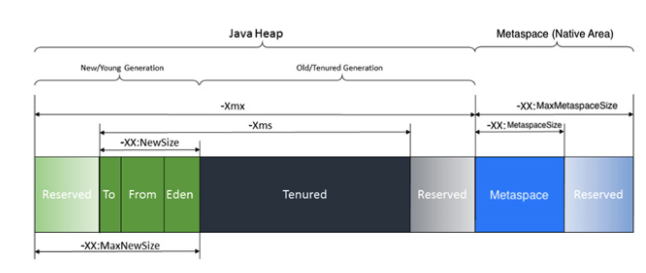
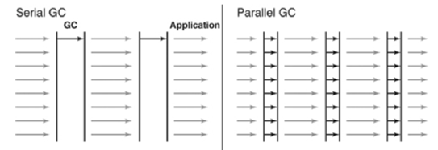

### 4.0 GC 모델

#### 4.1 Heap & GC
- java heap 구조(jdk 8 이상)는 아래 그림과 같다. Heap영역은 크게 New/Young Generation과 Old/Tenured Generation 영역으로 구분된다.

##### Minor GC
- 메모리에 객체가 생성되면 Eden영역에 객체가 할당(Allocation)된다.
- Eden영역이 가득차면 Eden영역에 있던 객체가 Survivor1 또는 Survivor2로 옮겨진다.
- 이렇게 Eden영역이 비워지고 Survivor 영역으로 객체가 이동하는 동작을 Minor GC(1차 GC)라고 한다.

##### Major GC
- 모든 객체는 Age bit를 가지고 있으며 Minor GC가 발생할 때마다 증가하도록 되어있다.
- Age bit가 일정 수치(Max Tenuring Threshold)를 초과하게 되는 경우 Old/Tenured Generation 영역으로 객체가 이동(Promotion)하게 된다.
- Old/Tenured Generation 영역이 가득차게되면 Major GC(2차 GC)가 발생한다.
- Major GC의 경우 모든 GC를 진행하는 Thread를 제외한 모든 Thread의 동작이 멈추는데 이러한 상태를 Stop-the-world라고 한다.
- 현재까지 발표된 모든 GC알고리즘 중 어떤 알고리즘을 사용하더라도 Stop-the-world를 피할 수는 없으며 개발자들이 GC를 튜닝하는 가장 큰 목적이 Stop-the-world 시간을 최소화하기 위함이다.

#### 4.2 java 21 에서 사용가능한 GC 
- java 21 에서는 G1GC, ParallelGC, SerialGC, ShenandoahGC, ZGC 5개의 GC를 사용할 수 있으며, Default GC는 G1GC 이다.

#### 4.2.1 oracle collector 선정 기준
- 애플리케이션에 엄격한 일시 중지 시간 요구 사항이 없는 한, 먼저 애플리케이션을 실행하고 VM이 수집기를 선택하도록 허용하세요.
- 필요하다면 성능을 개선하기 위해 힙 크기를 조정합니다.
- 성능이 여전히 목표에 미치지 못한다면 다음 지침을 시작점으로 삼아 수집기를 선택합니다.
  - Serial Collector: 어플리케이션이 작은 데이터를 다루거나 싱글 코어 환경에서 작동하는 경우
  - Parallel Collector: 어플리케이션의 전체 처리량이 중요하고 Stop the world 시간이 1초 이상이어도 괜찮은 경우
  - Garbage-First(G1): 응답 시간이 전체 처리량보다 더 중요하고 가비지 수집 일시 중지 시간을 짧게 유지해야 하는 경우
  - The Z Garbage Collector: 응답 시간이 높은 우선순위인 경우 사용

##### 4.2.2 Serial Collector 
- 싱글 스레드로 모든 종류의 가비지 컬렉션을 수행한다 (Context Switching으로 인한 Overhead를 줄일 수 있다).
- 멀티 코어 환경에서도 리소스를 제대로 활용 할 수 없으므로 적은 메모리와 CPU 코어의 수가 적을 때 적합한 방식.
- Young Generation Collection 알고리즘: Serial
- Old Generation Collection 알고리즘: Serial Mark Sweep Compact
- Mark Sweep Compact 알고리즘에서 Compact는 Heap 영역을 정리하기 위한 단계다.
- 유효한 객체들이 연속으로 쌓이도록 Heap 영역의 앞 부분부터 채워서 객체가 존재하는 부분과 존재하지 않는 부분으로 나누는 과정이다.
- 적용방식: -XX:+UseSerialGC

##### 4.2.3 Parallel Collector
- 알고리즘은 Serial GC와 동일하다.
- Serial GC는 Major GC와 Minor GC를 처리하는 Thread가 하나지만 Parallel GC의 경우 복수의 Thread가 GC를 진행한다.
- 충분한 메모리와 CPU의 코어를 갖춘 경우 유리한 GC의 종류
- Throughput GC라고도 부른다.
- Young Generation Collection 알고리즘: Parallel Scavenge
- Old Generation Collection 알고리즘: Serial Mark Sweep Compact
- 아래의 그림은 Serial GC와 Parallel GC를 비교한 그림이다.

##### 4.2.4 Concurrent Collectors 의 특징
- Concurrent의 탄생 목적은 stop the world 시간을 줄이는데 있다.
- 즉 어플리케이션이 구동하는 것과 Major GC를 Concurrency(동시에) 진행한다는 의미가 된다. 이러한 경우 Major GC가 발생하더라도 모든 thread가 중단되는 현상이 발생하지 않으며 어플리케이션이 중단되는 현상도 발생하지 않는다.
- 단, 어플리케이션이 동작하는 동시에 GC가 발생할 것이므로 Resource 사용량이 증가하게 되고 어플리케이션 전반적인 성능이 하락하게 된다.

##### 4.2.5 Garbage-First(G1)
- Eden, Survivor, Old 영역이 고정된 하나의 영역이 아니라 Region이라는 특정한 크기로 나뉘어져있다. Region의 상태에 따라 Region의 역할이 동적으로 변동하게 된다.
- Young Generation Collection 알고리즘: Snapshot-At-The-Beginning(SATB)
- Old Generation Collection 알고리즘: Snapshot-At-The-Beginning(SATB)

- 이 수집기는 작은 머신에서 많은 양의 메모리를 갖춘 대형 멀티프로세서 머신으로 확장하도록 설계되었습니다. 
- 높은 처리량을 달성하는 동시에 높은 확률로 일시 중지 시간 목표를 충족하는 기능을 제공합니다.
- 적용방식: -XX:+UseG1GC (대부분 운영체제에서 default로 설정됨)

##### 4.2.6 The Z Garbage Collector
- 8MB ~ 16TB에서 효율적으로 GC하기 위한 알고리즘
- ZGC는 밀리초 미만의 최대 일시 정지 시간을 제공하지만, 처리량이 다소 떨어집니다. 낮은 대기 시간이 필요한 애플리케이션을 위해 고안되었습니다.
- G1 collector 와 차이점은 G1GC의 Region은 역할은 동적이지만 크기는 고정이지만, ZGC의 ZPages는 크기가 2의 배수로 동적으로 생성 및 삭제가 가능하다.
- 적용방식: -XX:+UseZGC -XX:+ZGenerational.
 

#### 4.3 GC 적용 방안 
- jdk 21 에서 Concurrent Collectors 는 G1, ZGC 중에 선택하는 것으로 고려하고 있다. 
- ZGC가 낮은 대기시간이 필요한 경우이고 G1 GC는 높은 처리량에 강점이 있다. 
- 이중화 서버 각각 G1, ZGC 로 세팅하고 아래 정리한 Tool을 사용해 점검을 해봐야겠다.
  - VisualVM: Thread Dump 분석 (Heap Dump 분석도 가능하지만 아래의 MAT 분석이 더 많은 기능을 제공한다.)
  - MAT: Heap Dump 분석
  - Nmon: 서버 Resource 모니터링
  - Jmeter: 클라이언트 Application & 요청 결과 통계 추출
  - EasyGC: GC로그를 통한 분석 사이트

#### 참고문헌
- https://imprint.tistory.com/35

