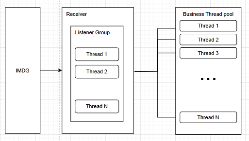

### 5.2 receiver thread 조절하기
- allin system 은 message queue 를 사용해서 타 시스템 요청을 받고 있는데, message queue 솔루션에서 1-2초 이상 queue 에 message 가 대기한다는 이야기를 들었다.
- message queue 응답을 기다리는 thread 이 business thread 들이 처리할 수 있는 처리량보다 적은 요청을 받고 있었다.
- 각 업무마다 응답을 수신하는 thread 를 조절할 수 있게 하여 business 가 처리할 수 있는 만큼 요청을 받을 수 있게 수정하였다.

#### 5.2.1 원인 
- message queue 응답을 기다리는 thread 이 business thread 들이 처리할 수 있는 처리량보다 적은 요청을 받고 있었다.
- business thread pool 은 100개의 일을 할 수 있는데 receiver 들이 20개의 일만 전달하고 있었다.
- 그러면서 message queue 에서 데이터가 쌓이는 현상이 발생하게 되었다.




#### 5.2.2 receiver 설정 변경
- 아래 설정은 listener thread 2개에 IQueue 에서 데이터 추출하고, worker thread 들과 협력하여 Business model 에게 요청하는 형태이다.
- 이 부분은 각 업무 부하량과 business model 이 처리할 수 있는 처리량을 검토해서 적정하게 결정해야 한다. 
```yaml
allin:
  hazelcast:
    receivers:
      - name: order
        listener-count: 2
        worker-count: 5
```